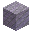
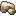
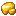
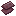

# Mining Materials

Mining materials are rare drops obtained through the [Custom Mining](../../mechanics/custom-mining.md) system. Fortune increases drop chance using the formula:

<strong>Effective chance</strong> = base chance x (1 + 0.25 x Fortune level)

Use [Divan's Pickaxe](../tools/divan-pickaxe.md) for doubled ore drops on top of Fortune.

## Refined Ores

All refined ores are used in the [Divan's Pickaxe](../tools/divan-pickaxe.md) recipe.

<table class="compact-table">
<thead>
<tr><th>Icon</th><th>Material</th><th>Source Ore</th><th>Base Chance</th></tr>
</thead>
<tbody>
<tr>
  <td></td>
  <td>Concentrated Stone</td>
  <td>Stone / Deepslate</td>
  <td>0.1%</td>
</tr>
<tr>
  <td></td>
  <td>Refined Lapis</td>
  <td>Lapis Ore</td>
  <td>0.25%</td>
</tr>
<tr>
  <td></td>
  <td>Refined Iron</td>
  <td>Iron Ore</td>
  <td>0.25%</td>
</tr>
<tr>
  <td></td>
  <td>Refined Gold</td>
  <td>Gold Ore</td>
  <td>0.25%</td>
</tr>
<tr>
  <td></td>
  <td>Refined Redstone</td>
  <td>Redstone Ore</td>
  <td>0.25%</td>
</tr>
<tr>
  <td></td>
  <td>Refined Diamond</td>
  <td>Diamond Ore</td>
  <td>0.5%</td>
</tr>
<tr>
  <td></td>
  <td>Refined Emerald</td>
  <td>Emerald Ore</td>
  <td>1%</td>
</tr>
<tr>
  <td></td>
  <td>Refined Netherite</td>
  <td>Ancient Debris</td>
  <td>1%</td>
</tr>
</tbody>
</table>

## Other Mining Materials

<strong>Concentrated Stone</strong> -- 0.1% from Stone/Deepslate. Used in: <a href="../weapons/dark-claymore/">Dark Claymore</a>, Efficiency 6

<strong>Alloy</strong> -- Found in Minecart Chests (2.5% chance). Used in: <a href="../tools/divan-pickaxe/">Divan's Pickaxe</a>

