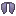

# Wither Lord Materials

All Wither Lord materials are **guaranteed drops** from the [Wither King](../../bosses/hard-mode/wither-king.md), the boss encountered during the [Hard Mode](../../mechanics/hard-mode.md) Wither Lords fight.

!!! warning "Hard Mode Only"
    The Wither King only spawns when the Wither Lords encounter is triggered with **BAD_OMEN** active. See [Hard Mode](../../mechanics/hard-mode.md) for details.

## Materials

 <strong>Maxor's Secrets</strong> -- Used in: <a href="../armor/maxor-boots/">Maxor's Boots</a>

 <strong>Shadow Warp</strong> -- Used in: <a href="../weapons/hyperion/">Hyperion</a>

 <strong>Implosion</strong> -- Used in: <a href="../weapons/hyperion/">Hyperion</a>

 <strong>Wither Shield</strong> -- Used in: <a href="../weapons/hyperion/">Hyperion</a>

 <strong>Handle (Necron's Handle)</strong> -- Used in: <a href="../weapons/hyperion/">Hyperion</a>

 <strong>Goldor's Secrets</strong> -- Used in: <a href="../armor/goldor-leggings/">Goldor's Leggings</a>

 <strong>Storm's Secrets</strong> -- Used in: <a href="../weapons/dark-claymore/">Dark Claymore</a>

 <strong>Necron's Secrets</strong> -- Used in: <a href="../armor/necron-elytra/">Necron's Elytra</a>

