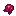
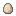
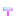

# Summon Items

Summon items are special name tags used to spawn bosses. To use one, **rename a mob** of the correct type with the summon item using an anvil. The mob will transform into the corresponding boss.

!!! tip "Hard Mode"
    If you have the **BAD_OMEN** potion effect when summoning, the **hard mode variant** spawns instead. See [Hard Mode](../../mechanics/hard-mode.md) for details on how to activate it.

## All Summon Items

<table class="compact-table">
<thead>
<tr><th>Icon</th><th>Item</th><th>Target Mob</th><th>Normal Boss</th><th>Hard Mode Boss</th><th>How to Obtain</th></tr>
</thead>
<tbody>
<tr>
  <td></td>
  <td>Atoned Flesh</td>
  <td>Zombie</td>
  <td><a href="../../bosses/generic/revenant-horror/">Revenant Horror</a></td>
  <td><a href="../../bosses/hard-mode/atoned-horror/">Atoned Horror</a></td>
  <td><code>/getopitems summon</code></td>
</tr>
<tr>
  <td></td>
  <td>Spider Relic</td>
  <td>Spider</td>
  <td><a href="../../bosses/generic/tarantula-broodfather/">Tarantula Broodfather</a></td>
  <td><a href="../../bosses/hard-mode/primordial-broodfather/">Primordial Broodfather</a></td>
  <td><code>/getopitems summon</code></td>
</tr>
<tr>
  <td></td>
  <td>Omega Egg</td>
  <td>Chicken</td>
  <td><a href="../../bosses/generic/chickzilla/">Chickzilla</a></td>
  <td><a href="../../bosses/hard-mode/enraged-chickzilla/">Enraged Chickzilla</a></td>
  <td>2% drop from Chickens</td>
</tr>
<tr>
  <td></td>
  <td>Corrupt Pearl</td>
  <td>Enderman</td>
  <td><a href="../../bosses/generic/zealot/">Zealot</a></td>
  <td><a href="../../bosses/hard-mode/zealot-bruiser/">Zealot Bruiser</a></td>
  <td><code>/getopitems summon</code></td>
</tr>
<tr>
  <td></td>
  <td>Antimatter</td>
  <td>Iron Golem</td>
  <td><a href="../../bosses/generic/melog-nori/">meloG norI</a></td>
  <td>Obfuscated meloG norI</td>
  <td><code>/getopitems summon</code></td>
</tr>
<tr>
  <td></td>
  <td>Giant Zombie Flesh</td>
  <td>Zombie</td>
  <td><a href="../../bosses/generic/sadan/">Sadan</a></td>
  <td><a href="../../bosses/hard-mode/hard-sadan/">Hard Mode Sadan</a></td>
  <td><code>/getopitems summon</code></td>
</tr>
<tr>
  <td></td>
  <td>Superior Remnant</td>
  <td>Enderman</td>
  <td><a href="../../bosses/generic/voidgloom-seraph/">Voidgloom Seraph</a></td>
  <td><a href="../../bosses/hard-mode/voidcrazed-seraph/">Voidcrazed Seraph</a></td>
  <td>Superior Dragon (always), other dragons (2%), <a href="../../bosses/ender-dragons/primal/">Primal Dragon</a> (always)</td>
</tr>
<tr>
  <td></td>
  <td>Wither Skeleton Spawn Egg</td>
  <td>Wither Skeleton</td>
  <td><a href="../../bosses/generic/infuriated-wither-skeleton/">Infuriated Wither Skeleton</a></td>
  <td>Same</td>
  <td><code>/getopitems summon</code></td>
</tr>
</tbody>
</table>
