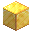

# Divan's Pickaxe

  
  

    DIVINE PICKAXE
  

## Stats

  Damage: 0
  Mining Speed: x1.33
  Range: +1

## Passive

!!! success "Passive Ability: Double Drops"
    Grants **x2 drops** from every ore mined.

## Crafting

  
Crafting Recipe

  

    

      

      

      

      

      

      

      

      

      

    

    
➜

    

      

    

  

### Ingredients

-  Refined Diamond
-  Alloy
-  Refined Emerald
-  Refined Gold
-  Netherite Pickaxe
-  Refined Iron
-  Refined Lapis
-  Refined Netherite
-  Refined Redstone
