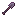
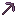

# Tools

Tools are utility items that provide non-damage abilities such as teleportation, healing, crowd control, and mining enhancements.

---

  <a href="aspect-of-the-void/">
    
    

      Aspect of the Void
      Teleportation shovel with two modes
      

        Damage: 0
        Type: Netherite Shovel
      

    

  </a>

  <a href="ice-spray-wand/">
    
    

      Ice Spray Wand
      Freezes and slows enemies in a radius
      

        Damage: 0
        Type: Wand
      

    

  </a>

  <a href="wand-of-restoration/">
    
    

      Wand of Restoration
      Heals over time
      

        Damage: 0
        Type: Wand
      

    

  </a>

  <a href="wand-of-atonement/">
    
    

      Wand of Atonement
      Upgraded healing wand
      

        Damage: 0
        Type: Wand
      

    

  </a>

  <a href="holy-ice/">
    
    

      Holy Ice
      Grants brief damage reduction
      

        Damage: 0
        Type: Utility
      

    

  </a>

  <a href="bonzo-staff/">
    
    

      Bonzo's Staff
      Shoots wind charges for mobility
      

        Type: Wand
      

    

  </a>

  <a href="tactical-insertion/">
    
    

      Tactical Insertion
      Marks and returns to a location
      

        Type: Utility
      

    

  </a>

  <a href="gyrokinetic-wand/">
    
    

      Gyrokinetic Wand
      Creates a gravity rift pulling mobs together
      

        Damage: 0
        Type: Wand
      

    

  </a>

  <a href="divan-pickaxe/">
    
    

      Divan's Pickaxe
      Divine pickaxe with double ore drops
      

        Mining Speed: x1.33
        Type: Pickaxe
      

    

  </a>

